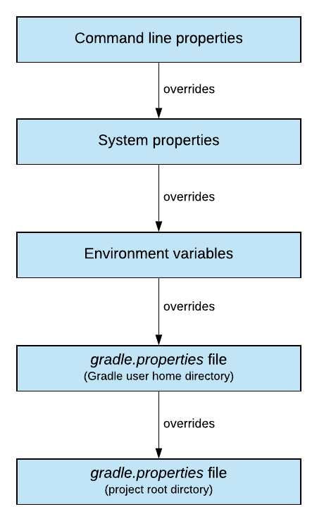

class: inverse, center, middle

# CI/CD implementálása Maven/Gradle, Jenkins és Docker eszközökkel

---

class: inverse, center, middle

# Bevezetés

---

## Continuous Delivery

* Elvek és gyakorlatok összessége
* Értékes és robosztus szoftver kiadására
* Rövid ciklusokban
* Funkcionalitás apró darabokban kerül hozzáadásra
* Bármelyik pillanatban kiadható
* Gyors visszajelzés
	* Üzleti oldalról
	* Technológiai oldalról
* Alapja: Jez Humble, Dave Farley: Continuous Delivery (Addison-Wesley, 2010)
* Technológiai és szervezeti vonatkozásai
* Daniel Bryant, Abraham Marín-Pérez: Continuous Delivery in Java (O'Reilly, 2018)

---

## Változás

* Azonnal buildelt
* Integrált
* Tesztelt
* Ellenőrzött
* Kiadásra kész

---

## Build pipeline

* Eszköze build pipeline
* Egy artifact megy végig: "single source of truth"

---

## Miért jó a fejlesztőknek?

* Minél koraibb visszacsatolás, annál kisebb a hibajavítás költsége
* Hibajavításkor nem nagyon régi kódhoz kell visszanyúlni
* Csökken a context switch költsége

---

## Automatizálás

* Automatizált, ismételhető, megbízható pipeline
* Automatizálandó:
	* Fordítás
	* Statikus kódellenőrzés
	* Tesztesetek (unit, komponens, integrációs, end-to-end)
	* Nemfunkcionális követelmények tesztelése (teljesítmény és biztonsági tesztek)
* Telepítés különböző környezetekbe (élest is beleértve)
* Adatbázis migrációk
* Változások listájának követése (change log)

---

## Ellenpélda

* Megbízhatatlan, körülményes telepítési folyamat
* Kiadás elodázása 
* Big bang release
* Lassú visszajelzés

---

## Definition of Done

* Legyen lekódolva
* Funkcionális követelmények
* Nemfunkcionális követelmények
	* Performancia
	* Biztonság

---

## Tipikus pipeline lépések

Elsődleges cél: annak bizonyítása, hogy minden változtatás kiadható

* Lokális fejleszés
* Commit
* CI
	* Package artifact
	* Statikus kódellenőrzés
	* Unit és integrációs tesztek
	* Repository-ba feltöltés
* Acceptance tests - automatikus
* User acceptance tests
* Staging környezet
* Éles környezetbe telepítés

---

## Lokális fejlesztés

* Éleshez közeli környezet
* Hatékonyság
* Virtualizáció vagy konténerizáció
* Test doubles

---

## Commit

* További lépések
	* Merge
	* Code review, Pull request

---

## CI

* Compile, build, package trunk/master branch alapján, létrejön az artifact
* Statikus kódellenőrzés
* Tesztek futtatása: izolált környezetben
* Tárolás repository-ban

---

## Acceptance tests

* Tesztek futtatása integrált környezetben
	* Kis számú automatizált
	* Happy path, user journey
* Nemfunkcionális követelmények ellenőrzése

---

## User acceptance tests

* Explanatory testing
* Tesztforgatókönyvek ideális esetben automatizáltak

---

## Staging

* Éleshez közeli környezet
* Azonos vagy anonimizált adatokkal
* Lehetőleg az éleshez hasonlatos külső rendszerekkel

---

## Éles környezet

* Continuous deployment
* Monitorozás, naplózás, riasztás

---

## Konténerizáció

* Lokális környezetben is kell tudni konténereket kezelni
* Háttérszolgáltatások (DB, queue, stb.) futtatása egyszerűbb
* Kapcsolódó rendszerek konténerben való futtatása egyszerűbb
* Artifact: image
* Automata teszteknél konténereket kell kezelni
* Élesbe is konténer megy

---

## Microservices környezet

* Több apró alkalmazás
* Több pipeline
* Pipeline-ok közötti függőségek
* Bonyolultabb tesztelés
    * Test double használata izolált környezetben
    * Több service vezérlése integrált környezetben
* A telepítést vezérelni kell
    * Verziókezelés, API kompatibilitás
* Egységes monitorozás, naplóbegyűjtés, riasztás

---

## DevOps

* A szereplők közötti kommunikáció és együttműködés magasabb szintre emelése
* Növeli az átláthatóságot
* Automatizált és monitorozott folyamatok
* Szoftverfejlesztés teljes folyamatára: integráció, tesztelés, telepítés
* Gyors, gyakori és megbízható
* Egy része a CD
* Mechanical sympathy - a fejlesztőt érdekelje a futtató infrastruktúra

---

## Metrikák

* Mennyi idő alatt kerül ki egy kódmódosítás az élesbe
* Nyitott hibák száma
* Sikeres kiadások aránya
* Megszakított kiadások aránya

---

## Javasolt architektúra

* CD szempontjából is különösen fontos
* High cohesion
* Loose coupling
* API fontossága (tesztelés belépő pontja)

---

## Twelve-Factor Apps hatása a CD-re

* Codebase: egyszerűbb, hogy minden egy repository-ban van 
(forráskód, szkriptek, pipeline, konfiguráció)
* Dependencies: Maven/Gradle explicit kezeli
* Config: Docker environment, vagy Spring Cloud Config/HasiCorp Vault
* Backing services: in-memory/konténer
* Build, release, run: Maven/Gradle biztosítja
* Processes: több konténer

---

## Twelve-Factor Apps hatása a CD-re

* Port binding: biztosítják a futtatókörnyezetek
* Concurrency: skálázás JVM-en belüli szálakkal és több
példánnyal (több konténer), automatizáltan tesztelendő
* Disposability: alkalmazás fejlesztéskor kell rá vigyázni
* Dev/prod parity: konténerizációval egyszerűsödik
* Logs: Naplózó keretrendszerek tudnak konzolra/fájlba írni
* Admin processes: Automatizáltan tesztelendő

---

## Platform típusok

* Hagyományos platform
* Cloud
	* Osztályozás hozzáférés szerint
		* Private
		* Public
		* Hybrid
	* Osztályozás funkcionalitás szerint
		* IaaS
		* PaaS
* Konténerek (Docker)
* Orchestration (Kubernetes)
* FaaS
	
---

## Hagyományos platform

* Saját platform, operációs rendszer,
	alkalmazásszerver, adatbázis, middleware
* Nincs standard CD megoldás
* Gyakran a környezet nincs lekódolva
* Gyakran nagy az üzemeltetés és a fejlesztés között a távolság

---

## Cloud

* Különböző típusú komponensek (compute, storage, network, backend services)
* Sok esetben van CD service is
* Felkészülni, hogy valamelyik komponens meghibásodik
* Immutable infrastructure
* Tipikusan programozható (Infrastructure as code)
* Java kötöttségek PaaS esetén (pl. verziószám, paraméterezés)

---

## Konténerek

* Konténerizáció az operációs rendszer szinten megvalósítható virtualizáció vagy process izoláció
* Docker ennek egy implementációja (kiegészítve felhasználóbarát feature-ökkel és repository kezeléssel)
* Hátránya, hogy egy új, akár teljes embert kívánó technológia, ami gyorsan változik
* Jobban passzol az immutable infrastructure-höz
* Java tapasztalatok
  * Java 9 előtt a host gép processzormagok számát adta vissza
  * A host `/dev/random` eszközt használja több alkalmazás, és ez lehet szűk keresztmetszet

---

## CD konténerizált környezetben

* CD pipeline image-et állít elő, és ezt kell végigvinni az élesig
* Saját container platform esetén Infrastructure as code (Terraform, Ansible), minden legyen verziókezelőben
* Alkalmazás konfigurációk, és akár build containerek konfigurációja is verziókezelőben
* Automatizáld a tanulási folyamataid eredményeid, előzd meg a hibáid újra előfordulását: load testing, security testing, chaos/resilience testing

---

## Orchestration

* Tipikusan Docker Swarm és Kubernetes
* Több konténer kezelése
* Container infrastructure as a service (CIaaS)
* Immutable infrastructure - nem egy konténer módosítása, hanem új konténer üzembe állítása
* Deklaratív, azaz az elvárt eredményt kell leírni
* Hátránya: egy újabb megtanulni és követendő technológia
* Javaslat: sose építsd saját Kubernetes clustert, inkább használj egyet egy szolgáltatótól! 

---

## Immutable és deklaratív <br /> infrastruktúra

* Jól dokumentált
* A kóddal együtt verziókezelhető
* Támogatja a self-healinget, azaz, ha leáll egy node, akkor az orcestration tudja, hogyan kell újat létrehoznia

---

## Kubernetes alapfogalmak

* _Pod_
  * Összetartozó konténerek egy csoportja (alkalmazás és pl. adatbázis, naplózás, monitorozás)
  * Megosztott fájlrendszer és hálózat
* _Services_
  * Load balancing
  * Naming
  * Discovery
* _Deployments_
* A három össze van kötve címkékkel az azonosíthatóság, együtt kezelés kedvéért

---

## FaaS

* Klasszikus alkalmazás felépítésére nem alkalmas,
 szinkron hívásokkal
* Event Driven Architecture
* Reactive
* Az infrastuktúrát a szolgáltató adja, csak a kóddal kell foglalkozni
* Java kötöttségek (módosított JRE-ben, kontrollált fájl és hálózatelérés, time limit)
* Érdemes monitorozni a hívások számát, erőforrásszükségletet
* Nem egyszerű tanulni
* Tesztelése sem egyszerű

---

class: inverse, center, middle

# Build

---

## Build

* Java bytecode-dá fordítás (kellenek függőségek)
* Unit tesztek futtatása
* Csomagolás (pl. JAR formátumba)
* Integrációs tesztek futtatása
* Telepítés lokális repo-ba (megosztás más lokális projektekkel)
* Telepítés távoli repo-ba (megosztás más fejlesztőkkel)

---

## Automatikus build eszközök <br /> jellemzői

* Dependency management, repository kezelés
* Incremental compilation
* Multimodule
* Profiles (különböző artifact különböző környezetekre?)
* Bővíthetőség: plugin
* Artifact release és deploy (repo-ba)

---

## Multi module project

* Funkciónként
* Rétegenként
* Monolit, de modularizált alkalmazásoknál
  * Jól definiált függőségek, míg nem volt Java Platform Module System
* Egyben buildelhető, release-elhető
  * Párhuzamosság
* Microservice-ek esetén jelentőségét vesztette
* Nagyon meg kell gondolni, hogy szükség van-e rá

---

## Monorepo vagy multiple <br /> repositories

* Egyben látható, kezelhető
* Segíti a tudásmegosztást, kódújrafelhasználást,
átláthatóságot
* Egyszerűbb lehet a service-eken átívelő tesztek felépítése
* Egyszerűbb a service-eken átívelő módosítások kezelése
* Elrettentő lehet
* Túl nagy méret, feature branch
* Maven pl. nincs kellően felkészítve rá

---

## Maven vs. Gradle

https://gradle.org/maven-vs-gradle/

* Maven
  * De facto standard, szélesebb körben elterjedt
  * Nehéz testreszabni
* Gradle
  * Nagyobb flexibilitás
  * Inkrementális build, csak ott fut le a build, ahol változás történt
  * Nagyra növő multimodule projektekhez

---

## Dependency

* GAV koordináták: groupID, artifactID, version
* Semantic versioning
* Tranzitív függőségek
* Dependency hell

---

## Gradle tulajdonságok

* Groovy-based DSL
* Taskok gráfja
* Sok konvenció megegyezik a Mavennel

---

## Gradle felépítés

* Alapfogalma a _project_ melynek építőelemei a _task_-ok
* Hogy ne kelljen a taskokat újra megírni és másolgatni, vannak a pluginok
  * [Java plugin](https://docs.gradle.org/current/userguide/java_plugin.html)

Taskok listázása:

```
gradlew tasks 
```

---

## Plugins

* Eltérni a konvencióktól nem szerencsés
* Biztos szükség van egyedi fejlesztésre
  * _Not invented here_

---

## Gradle plugins

https://plugins.gradle.org/

---

## Gradle Java Plugin

* _Source set_: forráskód logikai csoportosítása: alkalmazás kód, unit teszt, integrációs teszt

---

## Lifecycle

Nincs, csak plugin szinten


---

## Gradle wrapper


* Nem kell a gépen telepíteni Gradle-t
* `gradle/wrapper/gradle-wrapper.jar` - tölti le a fájlt
* `gradle/wrapper/gradle-wrapper.properties` - tartalmazza a verziószámot
  * Reprodukálható build

Gradle verzió frissítése:

```shell
gradlew wrapper --gradle-version 6.8.3
```

A `gradlew` futtatható legyen:

```shell
git update-index --chmod=+x gradlew
```

---

## Gradle függőségkezelés

* A függőségek _dependency configuration_-ökbe vannak szervezve

https://docs.gradle.org/current/userguide/java_plugin.html#sec:java_plugin_and_dependency_management

* compileOnly — for dependencies that are necessary to compile your production code but shouldn’t be part of the runtime classpath
* implementation (supersedes compile) — used for compilation and runtime
* runtimeOnly (supersedes runtime) — only used at runtime, not for compilation
* testCompileOnly — same as compileOnly except it’s for the tests
* testImplementation — test equivalent of implementation
* testRuntimeOnly — test equivalent of runtimeOnly

```shell
# Függőségi fa listázása
gradlew -q dependencies
```

---

## Függőség intervallumok

* Nem javasolt
* Nem reprodukálható build
* Manuálisan

---

## Gradle Versions Plugin

* [Gradle Versions Plugin](https://github.com/ben-manes/gradle-versions-plugin)

```shell
gradlew dependencyUpdates
```

---

## Projekteken átívelő függőségek

* Előnye: ugyanazok a függőségek a különböző projektekben
* Hátránya: szoros függőség
* Egy helyen deklarálni a függőségek verzióit 
  * BOM - bill of materials
* Vigyázzunk a különböző projektek között megosztott saját függőségekkel
  * Pl. entitások, API osztályok, stb.

---

## Maven projekteken átívelő <br /> függőségek

* Parent pom
* Dependency management

---

## Gradle projekten átívelő <br /> függőségek

* [Gradle Dependency Management Plugin](https://github.com/spring-gradle-plugins/dependency-management-plugin)
* Spring kapcsán fejlesztették ki
* Ezt használja a [Spring Boot Gradle Plugin](https://docs.spring.io/spring-boot/docs/2.4.3/gradle-plugin/reference/htmlsingle/)

---

## Frontend függőségek

* Egyszerűbb esetben: WebJars (JAR-ba csomagolva CSS, JavaScript library-k)


---

## Függőségek biztonsági <br /> ellenőrzése

---

## JAR hell futás időben

* [JHades](http://jhades.github.io/)
* `ClassNotFoundException` / `NoClassDefFoundError` kivételek megjelenésekor
* Az alkalmazás működik az egyik környezetben, de nem működik a másikon
* Az alkalmazás működik az egyik alkalmazásszerveren, de nem működik a másikon
* Ha módosítasz az alkalmazáson, és redeploy után nem látod a módosítást
* Ha az alkalmazás nem működik új függőség bevezetésekor, vagy egy függőség verziójának megváltoztatásakor

---

## Java vagy Java library

* `java-library` plugin, ha library-t fejlesztesz

https://docs.gradle.org/current/userguide/java_plugin.html

---

## Spring Boot Gradle plugin

```shell
gradlew build

gradlew -i build

gradlew bootRun
```

A `-i` kapcsoló INFO szintű naplózást állít

---

## Tesztlefedettség

```groovy
plugins {
    id 'jacoco'
}

test {
	useJUnitPlatform()
        finalizedBy jacocoTestReport
}

jacoco {
    toolVersion = "0.8.6"
}

jacocoTestReport {
    dependsOn test // tests are required to run before generating the report
}

```

* `0.8.6` - Java 15 támogatás

Hiába van beállítva a `sourceCompatibility` telepített Java 15 esetén, a Minor Number is 59, a Jacoco nem tudja feldolgozni

---

## Integrációs tesztek külön <br />futtatása

* Külön lépés a build során

---

## Integrációs tesztek - Maven

---

## Gradle properties



---

## Integrációs tesztek - Gradle

https://docs.gradle.org/current/userguide/java_testing.html#sec:configuring_java_integration_tests

Új könyvtár: `src/integration`, az alatt ugyanúgy `java` és `resources`

---

## Integrációs tesztek külön - IDEA

`build.gradle` fájlban:

```groovy
plugins {
  id 'idea'
}

idea {
    module {
        testSourceDirs += project.sourceSets.integrationTest.java.srcDirs
        testSourceDirs += project.sourceSets.integrationTest.resources.srcDirs
    }
}
```

---

## Integrációs tesztek <br /> valós adatbázison

```shell
docker run 
  -d
  -e MYSQL_DATABASE=employees 
  -e MYSQL_USER=employees 
  -e MYSQL_PASSWORD=employees 
  -e MYSQL_ALLOW_EMPTY_PASSWORD=yes
  -p 3306:3306 
  --name employees-mariadb 
  mariadb
```

---

## Integrációs teszteknek <br /> paraméterek átadása Gradle-ből

```groovy
systemProperty 'spring.datasource.url', findProperty('spring.datasource.url')
systemProperty 'spring.datasource.username', findProperty('spring.datasource.username')
systemProperty 'spring.datasource.password', findProperty('spring.datasource.password')
```

```shell
gradlew 
  -Pspring.datasource.url=jdbc:mariadb://localhost/employees 
  -Pspring.datasource.username=employees  
  -Pspring.datasource.password=employees 
  clean integrationTest
```

---

## Release

* Egyedi verziószámot ad a buildnek
* VCS-t is meg kell taggelni

---

## Maven

* Maven Release Plugin - nagyon sok műveletet elvégzett
  * Continuous Delivery-t nem támogatja
  * [Axel Fontaine blogja](https://axelfontaine.com/blog/dead-burried.html)
* Maven Versions Plugin
* Maven támogatás: property placeholder a `<version>` tagek között

```shell
mvnw deploy scm:tag -Drevision=$BUILD_NUMBER
```

* Ahol a `BUILD_NUMBER` környezeti változót a CI rendszer adja át
* Kombinálható a semantic versioninggel (manuálisan állítandó be)

---

## Maven pom.xml

```xml
<version>${revision}</version>

<plugin>
  <artifactId>maven-scm-plugin</artifactId>
  <version>1.9.4</version>
  <configuration>
      <tag>${project.artifactId}-${project.version}</tag>
  </configuration>
</plugin>
```

---

## Gitflow Maven támogatás

* [JGit-Flow](https://bitbucket.org/atlassian/jgit-flow/src/develop/) - Gitflowt támogató Maven plugin
  * Starting a release: branch és `pom.xml` átírás
  * Finishing a release
  * Starting and finishing a hotfix
  * Starting and finishing a feature

---

## Gradle release

* [Gradle release plugin](https://github.com/researchgate/gradle-release)

---

## Gradle release plugin lépések

* Nem commitolt fájlok ellenőrzése
* Bejövő vagy kimenő módosítások ellenőrzése
* Eltávolítja a `SNAPSHOT` részt a verziószámból
* Megkérdezi a release verziószámot
* Ellenőrzi, hogy van-e `SNAPSHOT` függőség
* Buildeli a projektet
* Commitol, ha történt verziószám módosítás (`SNAPSHOT` eltávolítás)
* Készít egy release taget
* Megkérdezi a következő verziót
* Commitolja

---

## Gradle release plugin <br /> paraméterezés

```shell
gradle release -Prelease.useAutomaticVersion=true  
	-Prelease.releaseVersion=1.0.0 -Prelease.newVersion=1.1.0-SNAPSHOT
```

---

class: inverse, center, middle

# Package

---

## Package

* JAR - függőségek nélkül
* Fat ("Uber") JAR - függőségekkel
  * Maven Shade Plugin
  * Maven Assembly Plugin (name conflict problémák lehetnek)
* Skinny JAR
  * SlimFast: S3-ra külön a JAR és külön a függőségek
* Megoldani konténerizációval: Spring Layered JAR
* WAR - függőségek az alkalmazásszerver részei
  * Skinny WAR - 3rd party libek külön


---

class: inverse, center, middle

# Bevezetés a Docker használatába

---

## Docker

* Operációs rendszer szintű virtualizáció
* Jól elkülönített környezetek, saját fájlrendszerrel és telepített szoftverekkel
* Jól meghatározott módon kommunikálhatnak egymással
* Kernelt nem tartalmaz, hanem a host Linux kernel izoláltan futtatja
   * Linux kernel cgroups és namespaces képességeire alapozva
* Kevésbé erőforrásigényes, mint a virtualizáció

---

## Docker


---

## Docker Windowson

* Docker Toolbox: VirtualBoxon futó Linuxon
* Hyper-V megoldás: LinuxKit, Linux Containers for Windows (LCOW), MobyVM
* WSL2 - Windows Subsystem for Linux - 2-es verziótól Microsoft által Windowson fordított és futtatott Linux kernel

---

## Docker felhasználási módja

* Saját fejlesztői környezetben reprodukálható erőforrások
  * Adatbázis (relációs/NoSQL), cache, kapcsolódó rendszerek <br /> (kifejezetten microservice környezetben)
* Saját fejlesztői környezettől való izoláció
* Docker image tartalmazza a teljes környezetet, függőségeket is
* Portabilitás (különböző környezeten futattható, pl. saját gép, <br /> privát vagy publikus felhő)

---

## További Docker komponensek

* Docker Hub - publikus szolgáltatás image-ek megosztására
* Docker Compose - több konténer egyidejű kezelése
* Docker Swarm - natív cluster támogatás
* Docker Machine - távoli Docker környezetek üzemeltetéséhez

---

## Docker fogalmak


---

## Docker konténerek

```shell
docker version
docker run hello-world
docker run -p 8080:80 nginx
docker run -d -p 8080:80 nginx
docker ps
docker stop 517e15770697
docker run -d -p 8080:80 --name nginx nginx
docker stop nginx
docker ps -a
docker start nginx
docker logs -f nginx
docker stop nginx
docker rm nginx
```

Használható az azonosító első három karaktere is

---

## Műveletek image-ekkel

```shell
docker images
docker rmi nginx
```

---

## Linux elindítása, bejelentkezés

```shell
docker run  --name myubuntu -d ubuntu tail -f /dev/null
docker exec -it myubuntu bash
```

---

## Volumes

* bind mount helyett
* Docker parancsokkal kezelhető
* Linux és Windows alatt is működik
* Meg lehet osztani konténerek között
* Egyszerűbben backupolható és visszaállítható
* További lehetőség: lokális vagy remote tárolás, titkosítás, stb.
* Tartalmuk előre feltölthető
* Mac-en és Windowson gyorsabb, mint a bind

```shell
docker volume ls
```

---


class: inverse, center, middle

# Java alkalmazások Dockerrel

---

## Saját image összeállítása

`Dockerfile` fájl tartalma:

```docker
FROM adoptopenjdk:11-jre-hotspot
WORKDIR /opt/app
COPY target/*.jar employees.jar
CMD ["java", "-jar", "employees.jar"]
```

Parancsok:

```shell
docker build -t employees .
docker run 
  -d 
  -e SPRING_DATASOURCE_URL=jdbc:mariadb://employees-mariadb/employees
  -e SPRING_DATASOURCE_USERNAME=employees
  -e SPRING_DATASOURCE_PASSWORD=employees
  --network jenkins
  --name employees
  -p 8080:8080 
  employees
```

---

## Build fájl átadása

```shell
docker build --file Dockerfile-build  .  
```

---

class: inverse, center, middle

# Docker layers

---

## Layers


`docker image inspect employees`

---

## Legjobb gyakorlat

* Külön változó részeket külön layerbe tenni
* Operációs rendszer, JDK, libraries, alkalmazás saját fejlesztésű része külön <br /> layerbe kerüljön

---

## Manuálisan

* Jar fájlt ki kell csomagolni, úgy is futtatható
  * `BOOT-INF/lib` - függőségek
  * `META-INF` - leíró állományok
  * `BOOT-INF/classes` - alkalmazás saját fájljai
  
```shell
java -cp BOOT-INF\classes;BOOT-INF\lib\* training.employees.EmployeesApplication
```  

---

## Dockerfile

* [Multi-stage build](https://docs.docker.com/develop/develop-images/multistage-build/)
  
```docker
FROM adoptopenjdk:14-jdk-hotspot as builder
WORKDIR app
COPY target/employees-0.0.1-SNAPSHOT.jar employees.jar
RUN jar xvf employees.jar

FROM adoptopenjdk:14-jre-hotspot
WORKDIR app
COPY --from=builder app/BOOT-INF/lib lib
COPY --from=builder app/META-INF META-INF
COPY --from=builder app/BOOT-INF/classes classes

ENTRYPOINT ["java", "-cp", "classes:lib/*", \
            	"training.employees.EmployeesApplication"]
```

---

## Spring támogatás

* Spring 2.3.0.M2-től
    * [Bejelentés](https://spring.io/blog/2020/01/27/creating-docker-images-with-spring-boot-2-3-0-m1)
* Layered JAR-s
* Buildpacks

---

## Layered JAR-s

* A JAR felépítése legyen layered
* Ki kell csomagolni
* Létrehozni a Docker image-t

---

## Layered JAR

```xml
<plugin>
  <groupId>org.springframework.boot</groupId>
  <artifactId>spring-boot-maven-plugin</artifactId>
  <configuration>
    <layers>
      <enabled>true</enabled>
    </layers>
  </configuration>
</plugin>
```

---

## Kicsomagolás

```shell
java -Djarmode=layertools -jar target/employees-0.0.1-SNAPSHOT.jar list

java -Djarmode=layertools -jar target/employees-0.0.1-SNAPSHOT.jar extract
```

---

## Dockerfile

```dockerfile
FROM adoptopenjdk:14-jre-hotspot as builder
WORKDIR application
COPY target/employees-0.0.1-SNAPSHOT.jar employees.jar
RUN java -Djarmode=layertools -jar employees.jar extract

FROM adoptopenjdk:14-jre-hotspot
WORKDIR application
COPY --from=builder application/dependencies/ ./
COPY --from=builder application/spring-boot-loader/ ./
COPY --from=builder application/snapshot-dependencies/ ./
COPY --from=builder application/application/ ./
ENTRYPOINT ["java", \
  "org.springframework.boot.loader.JarLauncher"]
```

---

## Buildpacks

* Dockerfile-hoz képest magasabb absztrakciós szint (Cloud Foundry vagy Heroku)
* Image készítése közvetlen Maven vagy Grade-ből
* Alapesetben Java 11, spring-boot-maven-plugin konfigurálandó <br /> `BP_JAVA_VERSION` értéke `13.0.2`

```shell
mvnw spring-boot:build-image
docker run -d -p 8080:8080 --name employees employees:0.0.1-SNAPSHOT
docker logs -f employees
```

```
gradlew bootBuildImage
```

---

## Gradle Docker plugin

https://github.com/bmuschko/gradle-docker-plugin
https://bmuschko.github.io/gradle-docker-plugin/


---

## Docker konténer futtatása <br /> Gradle-ből

```groovy
plugins {
  id 'com.palantir.docker-run' version '0.26.0'
}

dockerRun {
    def url = findProperty('spring.datasource.url')
    def username = findProperty('spring.datasource.username')
    def password = findProperty('spring.datasource.password')


    name 'my-employees'
    image 'employees'
    ports '8080:8080'
    daemonize true
    env 'spring.datasource.url': url, 'spring.datasource.username': username, 'spring.datasource.password': password
    arguments '--network=jenkins', '-P'
}
```

---

## Docker konténer futtatása <br /> Gradle-ből

```shell
gradlew 
  -Pspring.datasource.url=jdbc:mariadb://employees-mariadb/employees 
  -Pspring.datasource.username=employees  
  -Pspring.datasource.password=employees 
  dockerRun 
```

---

## Integrációs tesztelés Docker konténerekben

* Postman: Create collection, Create request, Create test
* [Newman](https://learning.postman.com/docs/running-collections/using-newman-cli/command-line-integration-with-newman/)
  * [Docker image](https://hub.docker.com/r/postman/newman)

```
git update-index --chmod=+x wait-for-it.sh 
```

```
docker run 
  -t 
  -v "/C/training/employees/integration-tests/postman:/etc/newman" 
  -v "/C/training/employees/integration-tests/wait:/opt/wait" 
  --entrypoint "" 
  postman/newman:5-ubuntu 
  /opt/wait/wait-for-it.sh -t 120 "http://employees-it-app:8080 newman run --environment=test.postman_environment.json employees.postman_collection.json
```

* *Windows alatt csak abszolút elérési útvonallal működik*
  * Docker compose esetén már megy a relatív elérési út

---

## Docker compose

[Wait-for-it](https://github.com/vishnubob/wait-for-it)
[Dockerize](https://github.com/jwilder/dockerize)

```
version: '3'

services:
  employees-it-mariadb:
    image: mariadb
    expose:
      - 3306
    environment:
      MYSQL_DATABASE: employees
      MYSQL_ALLOW_EMPTY_PASSWORD: 'yes' # aposztrófok nélkül boolean true-ként értelmezi
      MYSQL_USER: employees
      MYSQL_PASSWORD: employees

  employees-it-app:
    image: employees
    depends_on:
      - employees-it-mariadb
    environment:
      SPRING_DATASOURCE_URL: 'jdbc:mariadb://employees-it-mariadb:3306/employees'
    volumes:
    - ./wait:/opt/wait
    entrypoint: ["/opt/wait/wait-for-it.sh", "-t", "120", "employees-it-mariadb:3306", "--", "java", "org.springframework.boot.loader.JarLauncher"]
    expose:
      - 8080

  employees-it-newman:
    image: postman/newman:5-ubuntu
    volumes:
    - ./postman:/etc/newman
    - ./wait:/opt/wait
    entrypoint: []
    command: ["/opt/wait/wait-for-it.sh", "-t", "30", "employees-it-app:8080", "--", "newman", "run", 'employees.postman_collection.json', '-e', 'test.postman_environment.json']
    depends_on:
      - employees-it-app    
```

```
docker-compose up --abort-on-container-exit
```

* a `--abort-on-container-exit` kapcsoló hatására leállítja az összeset, ha egy is leáll


---

# Jenkins

* Docker in Docker
    * [Using Docker-in-Docker for your CI or testing environment? Think twice.](http://jpetazzo.github.io/2015/09/03/do-not-use-docker-in-docker-for-ci/)

---

## Jenkins

https://github.com/jenkinsci/docker/blob/master/README.md

```
docker build -t employees-jenkins .
```

```
docker network create jenkins

docker run 
  --detach 
  --network jenkins 
  --network-alias docker 
  --volume jenkins-data:/var/jenkins_home 
  --volume /var/run/docker.sock:/var/run/docker.sock 
  --publish 8090:8080 
  --name employees-jenkins 
  jenkins/jenkins:lts
```

```
docker run 
  --detach 
  --network jenkins 
  --volume jenkins-data:/var/jenkins_home 
  --volume /var/run/docker.sock:/var/run/docker.sock 
  --publish 8090:8080 
  --name employees-jenkins 
  employees-jenkins
```

* `--privileged` - Run Docker in Docker

Admin password

```
docker logs -f employees-jenkins
```

* Unlock Jenkins (password a logból)
* Selet Plugins to install (Git, Pipeline, Pipeline: Stage View, Docker, Docker Pipeline, Locale)
* Create Admin User
* Instance Configuration

---

## Docker in Docker

```
Got permission denied while trying to connect to the Docker daemon socket at unix:///var/run/docker.sock: Get http://%2Fvar%2Frun%2Fdocker.sock/v1.24/containers/adoptopenjdk:11-jdk-hotspot/json: dial unix /var/run/docker.sock: connect: permission denied
```

```
chmod 777 /var/run/docker.sock
```

```
docker exec --user root -it employees-jenkins chmod 777 /var/run/docker.sock
```

---

## Nyelv beállítása

* Locale plugin
* Manage / Configure System / Locale
  * Default Language: `en`
  * Ignore browser preference and force this language to all users: checked

---

## Pipeline

https://www.jenkins.io/doc/book/pipeline/docker/

---

## BlueOcean

https://www.jenkins.io/projects/blueocean/

---

## Új job

---

## Job létrehozása

* Új Item
* Projektnév megadása, pl. `employees`
* Pipeline
* Pipeline/Definition Pipeline script from SCM
* Git
* Repository URL kitöltése, pl. `https://github.com/Training360/employees`

---

## Futtatás, újrafuttatás

Újrafuttatás `clean`-nel, `Pipeline` szerkesztése

---

## Build number

```
def buildNumber = findProperty('buildNumber')
version = '0.0.1-' + buildNumber
```

```
stage('Build') { 
            steps {
                sh './gradlew -PbuildNumber=${BUILD_NUMBER} test assemble'
            }
        }
```


---

## SonarQube

```
docker run --name employees-sonarqube --detach 
  --network jenkins 
  --publish 9000:9000 
  sonarqube:lts
```

`admin`/`admin`

Csak Java 14

```
sourceCompatibility = '14'
targetCompatibility = '14'
```

https://hub.docker.com/_/sonarqube

/opt/sonarqube/conf: for Version 7.9.x only, configuration files, such as sonar.properties.
/opt/sonarqube/data: data files, such as the embedded H2 database and Elasticsearch indexes
/opt/sonarqube/logs: contains SonarQube logs about access, web process, CE process, Elasticsearch logs
/opt/sonarqube/extensions: for 3rd party plugins

Hiába van beállítva a `sourceCompatibility` telepített Java 15 esetén, a Minor Number is 59, a Jacoco nem tudja feldolgozni

## SonarLint

* SonarLint és SonarQube integráció

## Gradle integráció

https://docs.sonarqube.org/latest/analysis/scan/sonarscanner-for-gradle/

## Quality Profiles

* No import/export

## Quality Gates

* Mivel aszinkron működik, nem tudja buktatni a buildet

https://tomgregory.com/sonarqube-quality-gates-in-jenkins-build-pipeline/

---

## ArchUnit

`build.gradle` fájlban

```
testImplementation 'com.tngtech.archunit:archunit-junit5:0.17.0'
```

---

## ArchUnit teszteset

```java
@AnalyzeClasses(packages = "employees")
public class ArchUnitTest {

    @ArchTest
    public static final ArchRule layeredRule = layeredArchitecture()
                .layer("Controller").definedBy("..controller..")
                .layer("Service").definedBy("..service..")
                .layer("Persistence").definedBy("..repository..")

                .whereLayer("Controller").mayNotBeAccessedByAnyLayer()
                .whereLayer("Service").mayOnlyBeAccessedByLayers("Controller")
                .whereLayer("Persistence").mayOnlyBeAccessedByLayers("Service");
}
```

---

## ArchUnit szabályok

https://www.archunit.org/userguide/html/000_Index.html

---

# Nexus

---

## Nexus, mint proxy

---

docker run --name nexus --detach
  --network jenkins
  --publish 8091:8081
  --volume nexus-data:/nexus-data
  sonatype/nexus3

docker exec -it nexus cat /nexus-data/admin.password

gradlew bootJar upload

```
plugins {
    id 'maven-publish'
}

publishing {
    publications {
        bootJava(MavenPublication) {
            artifact bootJar
        }
    }
    repositories {
        maven {
            def nexusUrl = findProperty('nexusUrl')
            def releasesRepoUrl = nexusUrl + "/repository/maven-releases/"
            def snapshotsRepoUrl = nexusUrl + "/repository/maven-snapshots/"
            url = version.endsWith('SNAPSHOT') ? snapshotsRepoUrl : releasesRepoUrl
            credentials {
                username findProperty('nexusUsername')
                password findProperty('nexusPassword')
            }
        }
    }
}
```

---

## Jenkinsből Nexus publish

https://www.jenkins.io/doc/book/pipeline/docker/

```
stage('Publish') {
            steps {
                                sh './gradlew -PbuildNumber=${BUILD_NUMBER} -PnexusUrl=http://nexus:8081 -PnexusUsername=admin -PnexusPassword=admin publish'
                            }
        }
```


---

# Build Docker image

---

